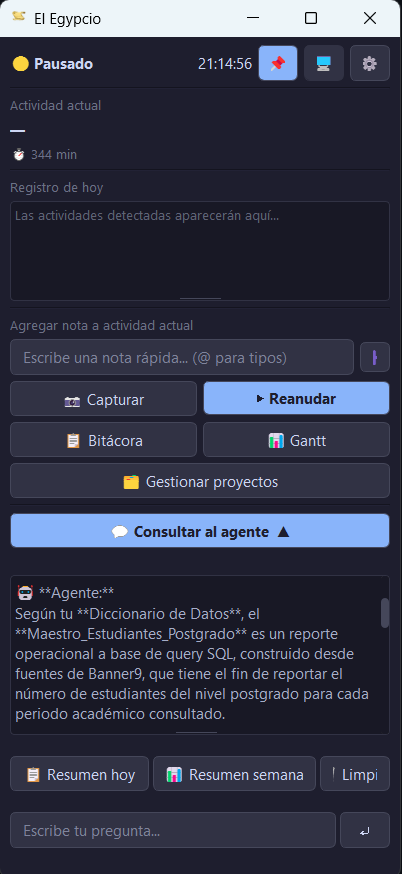
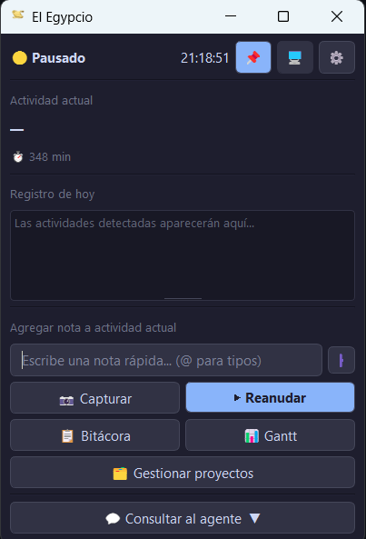
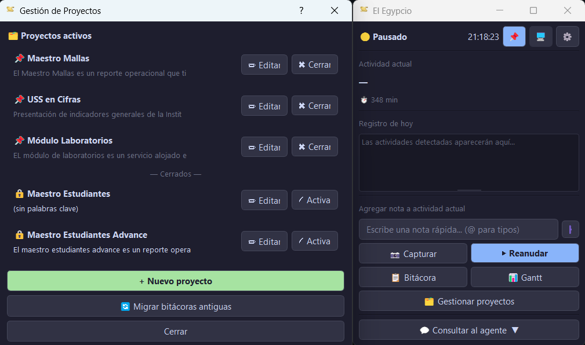
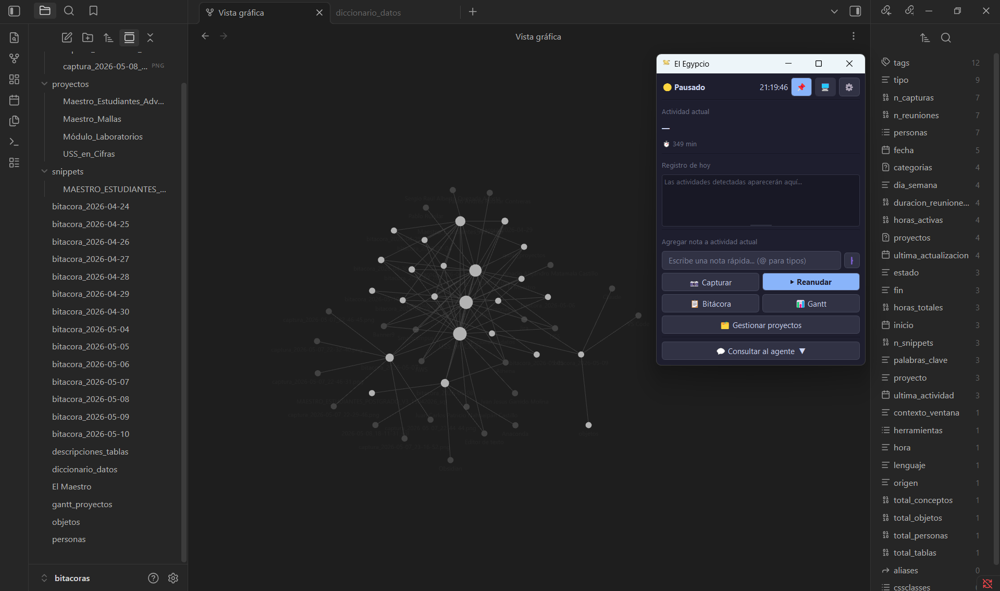
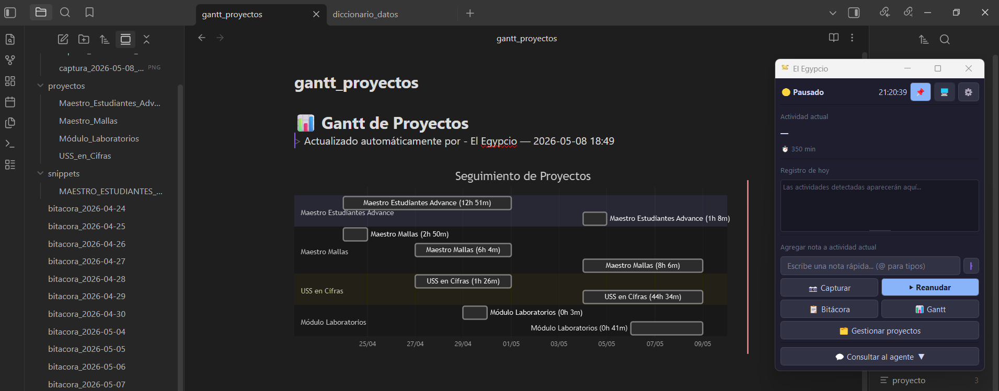
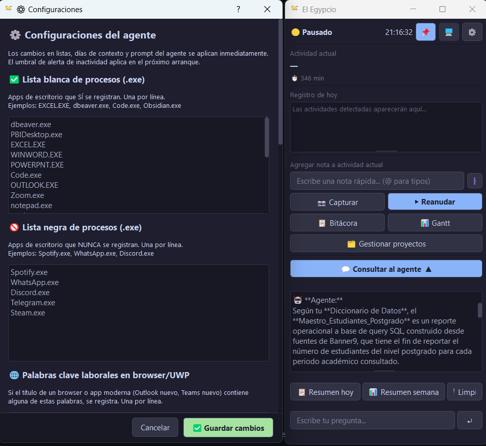
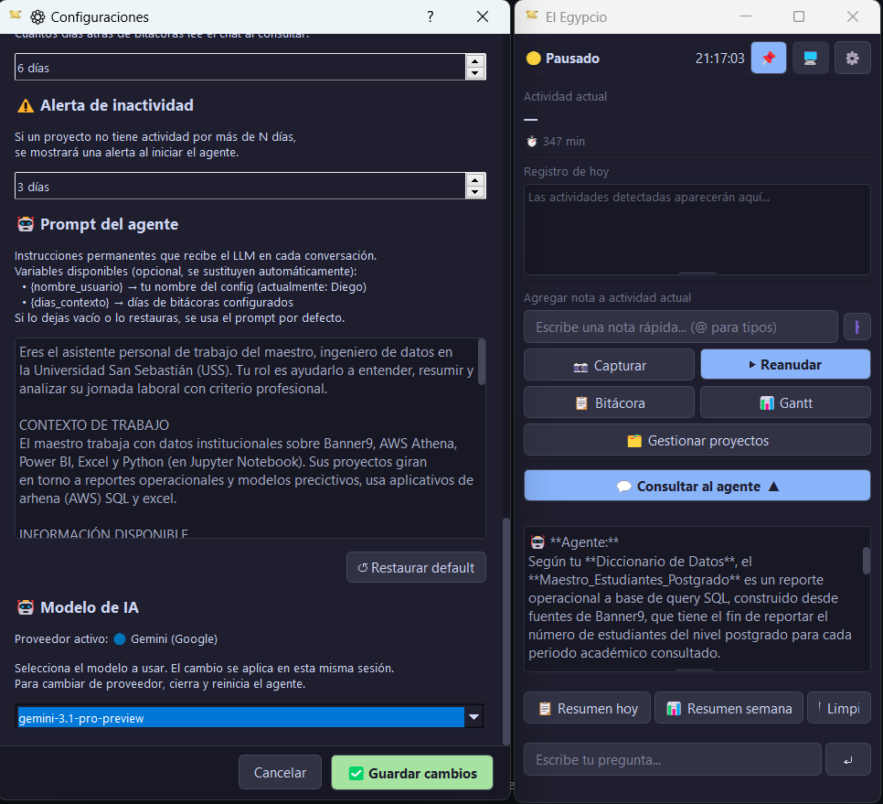

<p align="center">
  
</p>

<h3 align="center">Tu jornada laboral, escrita sola.</h3>

<p align="center">
  <i>Un agente de IA que observa tu pantalla, entiende qué haces y lo documenta —<br/>
  con wikilinks, snippets, Gantt y memoria semántica— directo en tu vault de Obsidian.</i>
</p>

<p align="center">
  
  
  
  
  
  
</p>

---

## 🎯 Filosofía del proyecto

> *"En el antiguo Egipto, los escribas eran los guardianes del conocimiento. Acompañaban a faraones, comerciantes y sacerdotes documentando cada movimiento, decisión y transacción para la posteridad. Sin ellos, la memoria del imperio se habría perdido en el tiempo."*

Hoy enfrentamos un problema parecido: trabajamos durante horas, pasamos por decenas de aplicaciones, resolvemos problemas, asistimos a reuniones... y al final del día apenas recordamos qué hicimos. Las herramientas tradicionales requieren disciplina manual: anotar, etiquetar, organizar. **El Egypcio resuelve esto siendo invisible**: trabaja en segundo plano, observa con respeto y documenta con criterio.

Este proyecto nace de la convicción de que el trabajo de conocimiento merece ser preservado, y que la IA puede ser una compañera de trabajo silenciosa pero rigurosa — como aquellos escribas del Nilo.

---

## ✨ El problema que resuelve

Eres profesional del conocimiento. Saltas entre **DBeaver, Athena, Excel, Power BI, Jupyter, GitHub, Teams, Outlook** todo el día. Al final de la semana tu jefe pregunta *"¿en qué avanzaste?"* y no recuerdas la mitad. Llenar bitácoras a mano se siente como un segundo trabajo.

**El Egipcio** observa tu pantalla en silencio, entiende qué haces gracias a un LLM con visión, y escribe la bitácora por ti — en Markdown, con wikilinks, snippets de código extraídos automáticamente, clasificación por proyecto y diagramas Gantt.

> *"Escribe el pasado. Ejecuta el futuro."*

---

## 🎯 ¿Qué hace, en concreto?

- 🕵️ **Detecta tu ventana activa** cada segundo con un sistema híbrido (proceso `.exe` para apps, keywords para browsers/UWP)
- 📸 **Toma screenshots** cuando una ventana se mantiene estable y se las envía al LLM con visión
- 🤖 **Analiza la actividad**: qué herramienta usas, qué tarea haces, qué URLs son laborales
- 📝 **Escribe entradas en Markdown** con wikilinks automáticos a herramientas, fuentes de datos y personas conocidas
- 🏷️ **Reconoce notas estructuradas** que escribes tú (`@decision`, `@tarea`, `@acuerdo`, `@idea`, `@bloqueado`, `@ticket`, `@pendiente`, `@objeto`, `@diccionario`, `@persona`) y las **acumula en archivos agregados por tipo** (`decisiones.md`, `tareas.md`, etc.)
- 💾 **Extrae código** que pegues en notas (SQL, Python, Bash, JS, JSON, YAML) a archivos snippet separados con frontmatter
- 📊 **Clasifica cada actividad por proyecto** usando un modelo rápido y barato del LLM
- 📈 **Mantiene un Gantt global y un Gantt por proyecto** en Mermaid, listos para renderizar en Obsidian
- 🗂️ **Genera MOCs (Map of Content)** por proyecto con métricas, snippets y resúmenes calculados localmente
- 💬 **Chat conversacional** con contexto de las últimas N bitácoras + archivos de referencia curados + carga condicional de archivos de task según la pregunta
- 💸 **Monitor FinOps integrado**: tokens y costo de cada llamada al LLM, agrupado por tipo de operación
- 🎨 **5 temas visuales** seleccionables (incluyendo alto contraste para accesibilidad)
- ⚠️ **Alertas de inactividad** para proyectos activos abandonados hace varios días

---

## 🌟 Características destacadas

### 🖼 Una interfaz que no estorba

<p align="center">
  
  &nbsp;&nbsp;&nbsp;
  
</p>

Ventana flotante, anclable, redimensionable. El panel superior muestra el estado del agente, la hora, el botón de anclar, el selector de monitor y la configuración. Debajo, la actividad actual con duración acumulada, el registro del día, y el campo de notas rápidas con autocompletado de prefijos `@`. Todo en un único lugar, sin estorbar tu trabajo real.

### 🔐 Multi-proveedor de IA
Soporta **Claude (Anthropic), OpenAI (ChatGPT) y Gemini (Google)** con una capa de abstracción única. Cambias de proveedor desde un popup de login al iniciar, sin tocar código. Cada proveedor tiene su modelo principal y un modelo rápido para tareas de clasificación, optimizando costos.

### 🖥️ Multi-monitor con filtrado físico
¿Trabajas con dos monitores y solo quieres documentar lo que pasa en uno? El Egipcio detecta en qué monitor físico está cada ventana y filtra capturas según el monitor que selecciones. También puede capturar todos en modo panorámico.

### 🧠 Análisis con visión + URLs
Cada captura se envía al LLM con visión para describir la actividad en lenguaje natural. Adicionalmente, **detecta URLs visibles** en la pantalla (barra del browser, links abiertos) y las filtra contra una lista de dominios laborales antes de registrarlas.

### 🔗 Wikilinks automáticos
El agente reconoce **herramientas, fuentes de datos y personas conocidas** mencionadas en cada entrada y las convierte en wikilinks `[[...]]` compatibles con Obsidian. El grafo de tu vault se construye solo a medida que trabajas.

### 💾 Snippets automáticos
Si pegas código en una nota (≥2 líneas), el agente detecta el lenguaje (SQL, Python, Bash, JS, JSON, YAML), lo extrae a un archivo `.md` aparte en `bitacoras/snippets/`, le pone frontmatter con metadata y lo enlaza desde la bitácora del día y desde el MOC del proyecto.

### 📊 Gantt en Mermaid
Cada vez que una entrada supera 2 minutos, un modelo rápido del LLM la clasifica contra tus proyectos activos. El tiempo se suma a un Gantt global (`gantt_proyectos.md`) y a un Gantt individual por proyecto. Todo en Mermaid, todo legible directamente en Obsidian.

### 🗂️ MOCs por proyecto
Cada proyecto tiene un `.md` propio con:
- **Frontmatter ampliado** con métricas (horas totales, días activos, capturas, personas, fuentes top)
- **Sección de snippets** relacionados, enlazados como wikilinks
- **Sección de resumen** con semáforo de actividad, top herramientas, top fuentes y personas más mencionadas
- **Entradas agrupadas por día** con enlaces directos a las bitácoras donde aparecen

<p align="center">
  
</p>

Desde el botón **🗂 Gestionar proyectos** abres este popup para crear, editar, cerrar o reactivar proyectos. El botón **🔁 Migrar bitácoras antiguas** procesa las bitácoras existentes y clasifica retroactivamente cada entrada contra los proyectos activos, reconstruyendo el Gantt y los MOCs desde cero.

### 💬 Chat con contexto curado
Pregúntale al agente *"¿cuánto avancé esta semana en Maestro Mallas?"* o *"resúmeme la reunión con Pablo del martes"*. Lee las últimas N bitácoras + archivos de referencia (`objetos.md`, `personas.md`, `diccionario_datos.md`, `proyectos_relevantes.md`) y responde con precisión. Incluye atajos rápidos: **resumen del día** y **resumen de la semana**, que puedes guardar de vuelta en la bitácora.

Además, el chat **carga condicionalmente los archivos agregados de task** según tu pregunta. Si preguntas *"¿qué pendientes tengo?"* carga `pendientes.md`; si preguntas *"¿qué decidí esta semana?"* carga `decisiones.md`. El sistema detecta keywords (con tolerancia a tildes y mayúsculas) y solo trae lo necesario, optimizando tokens.

### 🗃️ Archivos agregados por tipo de task
Cada vez que escribes una nota estructurada con prefijo (`@decision`, `@tarea`, `@acuerdo`, `@idea`, `@bloqueado`, `@ticket`, `@pendiente`), la entrada se acumula en un **archivo agregado por tipo** dentro de tu vault:

| Prefijo | Archivo agregado |
|---|---|
| `@decision:` | `decisiones.md` |
| `@tarea:` | `tareas.md` |
| `@acuerdo:` | `acuerdos.md` |
| `@idea:` | `ideas.md` |
| `@bloqueado:` | `bloqueados.md` |
| `@ticket:` | `tickets.md` |
| `@pendiente:` | `pendientes.md` |

Estos archivos tienen formato cronológico (agrupado por día) con wikilinks a la bitácora donde se registró cada entrada. La línea sigue apareciendo en la bitácora del día como hasta ahora, solo se suma esta acumulación adicional para tener un "registro maestro" por tipo.

### 💸 FinOps — Monitor de gasto de API
Un módulo integrado en el popup de Configuraciones que muestra:
- **Tarjetas Hoy / Este mes** con costo USD, llamadas y tokens.
- **Desglose por tipo de operación**: captura de actividad, captura de reunión, clasificación de proyecto, chat usuario, resúmenes — con barras de porcentaje.
- **Gráfico de 5 días** para ver tendencia.
- **Modelo activo y sus precios** por millón de tokens, con fecha de última actualización.
- **Override de precios** en `config.json` → `finops.precios_override`, por si los precios cambian.

Los tokens se interceptan en cada llamada al LLM y se persisten agregados por día (archivo `bitacoras/finops_data.json`). FinOps nunca rompe el flujo principal: si algo falla, la llamada al LLM continúa normalmente.

### 🎨 5 temas visuales seleccionables
La interfaz soporta 5 temas (skins) cambiables desde Configuraciones, con vista previa en vivo antes de guardar:

| Tema | Tipo | Caracterización |
|---|---|---|
| 🌙 Catppuccin Mocha | Oscuro azulado | Default — sofisticado, paleta pastel |
| 🌿 Catppuccin Latte | Claro azulado | Versión clara para luz natural |
| 🧛 Dracula | Oscuro violeta | Clásico para devs |
| 🌊 Nord | Oscuro frío | Tonos escandinavos azul-gris |
| ⚡ Alto contraste | Negro + verde fosforescente | Accesibilidad / fatiga visual |

El cambio de tema se aplica en caliente a la ventana principal y al popup activo, sin reiniciar el agente. Si previsualizas y cancelas, vuelve al tema anterior automáticamente.

---

## 🏛 Arquitectura del proyecto

```
📁 El Egipcio/
│
├── 📄 agente.py                    # Orquestador principal
├── 📄 monitor.py                   # Detección híbrida de ventana activa
├── 📄 captura.py                   # Screenshot + análisis con LLM (visión + URLs)
├── 📄 bitacora.py                  # Escritura .md + wikilinks + snippets + frontmatter + archivos agregados por task
├── 📄 chat.py                      # Chat conversacional con contexto curado + carga condicional de archivos task
├── 📄 gantt.py                     # Clasificación por proyecto + Gantt global
├── 📄 proyectos.py                 # MOCs por proyecto + Gantt individual + migración
├── 📄 ventana.py                   # GUI PyQt5 + system tray + popups + selector de temas
├── 📄 popup_login.py               # Autenticación multi-proveedor
├── 📄 cliente_ia.py                # Abstracción Claude / OpenAI / Gemini + interceptor FinOps
├── 📄 finops.py                    # Monitor de gasto API: tokens, costo, agregados diarios
├── 📄 temas.py                     # Catálogo de 5 temas visuales (skins)
├── 📄 utils.py                     # Carga de config + detección de Obsidian
├── 📄 limpiar_wikilinks_herramientas.py   # Script de limpieza retroactiva
│
├── 📄 config.json                  # Configuración principal (editable desde UI)
├── 📄 config_template.json         # Plantilla para nuevos usuarios
├── 📄 estado.json                  # Estado interno (generado automático)
│
├── 📁 assets/                      # Iconos de la app
│   ├── agente.ico
│   └── ventana.ico
│
├── 📁 imagenes/                    # Recursos visuales del repo
│   └── LOGO_EL_EGIPCIO.png
│
└── 📁 bitacoras/                   # Output del agente
    ├── bitacora_YYYY-MM-DD.md          # Bitácora diaria
    ├── gantt_proyectos.md              # Gantt global Mermaid
    ├── gantt_data.json                 # Datos crudos del Gantt
    ├── finops_data.json                # Datos crudos de FinOps (agregados por día)
    │
    ├── objetos.md                      # Registro de objetos (@objeto:)
    ├── personas.md                     # Registro de personas (@persona:)
    ├── diccionario_datos.md            # Diccionario (@diccionario:)
    │
    ├── decisiones.md                   # Archivos agregados por tipo de task
    ├── tareas.md                       # (cronológicos, agrupados por día,
    ├── acuerdos.md                     #  con wikilinks a la bitácora origen)
    ├── ideas.md
    ├── bloqueados.md
    ├── tickets.md
    ├── pendientes.md
    │
    ├── 📁 proyectos/                   # Un .md por proyecto (MOCs)
    │   ├── Maestro_Mallas.md
    │   └── USS_en_Cifras.md
    │
    ├── 📁 snippets/                    # Código extraído de notas
    │   └── snippet_YYYY-MM-DD_HH-MM_sql_*.md
    │
    └── 📁 imagenes/                    # Capturas manuales en alta calidad
        └── captura_YYYY-MM-DD_HH-MM-SS.png
```

---

## 🔄 Flujo de funcionamiento

```
┌─────────────────────────────────────────────────────────────────┐
│                  Windows — ventana activa                        │
│         (cambio detectado por win32gui + psutil)                 │
└──────────────────────────────┬──────────────────────────────────┘
                               │
                               ▼
┌─────────────────────────────────────────────────────────────────┐
│                          monitor.py                              │
│                                                                  │
│  ¿Proceso en lista_negra_procesos?     ──→ ignorar              │
│  ¿Es browser o UWP?                                              │
│       SÍ → match keywords en título                              │
│       NO → match exacto contra lista_blanca_procesos             │
│  ¿Ventana en monitor seleccionado?     ──→ filtrar               │
│  ¿Título estable N segundos?            ──→ disparar             │
└──────────────────────────────┬──────────────────────────────────┘
                               │
                               ▼
┌─────────────────────────────────────────────────────────────────┐
│                          captura.py                              │
│                                                                  │
│  Screenshot del monitor seleccionado (mss)                       │
│  Reducción a 50% + JPEG 70% → base64                             │
│  Llamado a cliente IA con visión activo                          │
│  Análisis: actividad, herramienta, categoría, URLs visibles      │
│  Filtrado de URLs contra dominios_laborales                      │
└──────────────────────────────┬──────────────────────────────────┘
                               │
                               ▼
┌─────────────────────────────────────────────────────────────────┐
│                         bitacora.py                              │
│                                                                  │
│  Detección de herramienta canónica, fuentes y personas           │
│  Enriquecimiento de la actividad con wikilinks [[...]]           │
│  Escritura de cabecera de entrada al .md                         │
│  Notas manuales → snippets si tienen código                      │
│  Frontmatter YAML recalculado al cierre del día                  │
└──────────────────────────────┬──────────────────────────────────┘
                               │
                               ▼
┌─────────────────────────────────────────────────────────────────┐
│                         gantt.py                                 │
│                                                                  │
│  Clasificación de la actividad → modelo rápido del LLM           │
│  Match contra proyectos activos del config                       │
│  Suma de tiempo al Gantt global + Gantt del proyecto             │
│  Actualización del .md del proyecto (MOC)                        │
└──────────────────────────────┬──────────────────────────────────┘
                               │
                               ▼
┌─────────────────────────────────────────────────────────────────┐
│                         ventana.py                               │
│                                                                  │
│  Actualización del panel de actividad actual                     │
│  Log del día visible en la ventana                               │
│  Notificación discreta en el system tray                         │
└─────────────────────────────────────────────────────────────────┘
```

---

## 🧩 Sistema de detección híbrido

| Tipo de app | Método | Configuración en `config.json` |
|---|---|---|
| Apps de escritorio | Exact-match por proceso `.exe` | `lista_blanca_procesos` |
| Apps siempre ignoradas | Exact-match negativo | `lista_negra_procesos` |
| Browsers (Chrome, Edge, Firefox…) | Keyword-match en título | `palabras_clave_laborales_browser` |
| Apps UWP (`ApplicationFrameHost.exe`) | Keyword-match en título | `palabras_clave_laborales_browser` |
| Pestañas de entretenimiento | Keyword-match negativo | `keywords_bloqueadas_browser` |
| Reuniones virtuales | Keyword-match en título | `palabras_clave_reunion` |
| URLs detectadas en pantalla | Filtrado contra dominios | `dominios_laborales` |

---

## 🏷️ Notas estructuradas

Mientras trabajas, puedes escribir notas rápidas en el campo de entrada. Si empiezas con uno de estos prefijos, la nota se etiqueta y aparece destacada al inicio de la bitácora **y** se acumula en un archivo agregado por tipo:

| Prefijo | Uso | Archivo agregado |
|---|---|---|
| `@decision:` | Decisiones tomadas durante la jornada | `decisiones.md` |
| `@tarea:` | Tareas que surgen y debes hacer después | `tareas.md` |
| `@acuerdo:` | Acuerdos cerrados en reuniones | `acuerdos.md` |
| `@idea:` | Ideas o hipótesis para retomar | `ideas.md` |
| `@bloqueado:` | Bloqueos que impiden avanzar | `bloqueados.md` |
| `@ticket:` | Tickets, IDs de incidencias | `tickets.md` |
| `@pendiente:` | Cosas que quedan abiertas al cierre | `pendientes.md` |
| `@objeto:` | Registrar un nuevo objeto (tabla, vista) | `objetos.md` (upsert por nombre) |
| `@diccionario:` | Registrar un concepto/sigla | `diccionario_datos.md` (upsert por nombre) |
| `@persona:` | Registrar una persona nueva | `personas.md` (upsert por nombre) |

Los **archivos agregados** son cronológicos: cada entrada nueva se suma como una línea bajo la sección del día (`## YYYY-MM-DD`), con un wikilink a la bitácora de origen. Esto permite consultar todo el histórico por tipo (ej. *"¿qué decisiones tomé este mes?"*).

Los archivos de **referencia** (`objetos.md`, `personas.md`, `diccionario_datos.md`) usan upsert por nombre: si registras el mismo objeto dos veces, se actualiza, no se duplica.

Si pegas código (≥2 líneas) en una nota, el agente detecta el lenguaje automáticamente, extrae el snippet a su propio archivo `.md` y lo enlaza desde la bitácora y el MOC del proyecto.

---

## 🚀 Instalación

### Requisitos previos

- **Windows 10 / 11**
- **Python 3.10+**
- **API Key** de al menos uno de: [Anthropic](https://console.anthropic.com/) · [OpenAI](https://platform.openai.com/) · [Google AI Studio](https://aistudio.google.com/)
- **Obsidian** (opcional pero altamente recomendado)

### 1. Clonar e instalar

```bash
git clone https://github.com/tu-usuario/el-egipcio.git
cd el-egipcio
pip install -r requirements.txt
```

### 2. Dependencias principales

| Paquete | Uso |
|---|---|
| `anthropic` / `openai` / `google-genai` | Clientes oficiales de cada LLM |
| `pywin32` | Detección de ventanas Windows |
| `psutil` | Obtención de nombre de proceso |
| `mss` | Captura multi-monitor de alto rendimiento |
| `Pillow` | Procesamiento de imágenes |
| `PyQt5` | GUI + system tray |

### 3. Configurar `config.json`

Copia `config_template.json` a `config.json` y completa al menos:

```json
{
  "ia_proveedor": "claude",
  "ia_api_keys": {
    "claude": "sk-ant-...",
    "openai": "",
    "gemini": ""
  },
  "nombre_usuario": "TuNombre",
  "ruta_base": "",
  "ruta_obsidian_1": "",
  "proyectos": []
}
```

Casi todo se puede dejar en blanco — el agente autocompleta rutas detectando Obsidian y usa la carpeta del script como `ruta_base` por defecto. Todo lo demás (listas blancas/negras, palabras clave, system prompt, modelo IA, días de contexto, monitor) se edita desde la UI sin tocar el JSON.

### 4. Arrancar

```bash
python agente.py
```

Aparecerá el popup de login. Selecciona proveedor, pega la API key, conecta. La ventana principal se abre y el agente queda monitoreando en el system tray.

---

## 📋 Ejemplo de bitácora generada

```markdown
---
fecha: 2026-05-10
horas_totales: 7.3
proyectos: [Maestro Mallas]
personas: [[Pablo]], [[Diego]]
herramientas_top: SQL, Power BI, Excel
fuentes_top: [[Banner9]], [[Athena]]
n_capturas: 23
n_notas_estructuradas: 4
---

# 🗓 Bitácora — 2026-05-10

## ⭐ Destacado del día

- 🎯 **@decision (10:42):** Migrar el modelo de mallas a estructura por área en lugar de por programa
- ✅ **@acuerdo (14:30):** [[Pablo]] revisará la query de laboratorios el viernes
- 📌 **@tarea (15:18):** Documentar el cambio de schema en Confluence
- 🚧 **@bloqueado (16:05):** Falta acceso a la vista `vw_planta_fisica` en Athena

---

## 08:32 | SQL — Athena
🔧 **Herramienta:** DBeaver
📌 **Actividad:** Construcción de query sobre [[Banner9]] para extraer matrículas de pregrado del período 202610, con joins a tablas de programa y sede.
⏱ **Duración:** 28 min
🏷 #sql #proyecto/maestro-mallas #fuente/banner9

## 09:00 | Browser — Athena Query Editor
🔧 **Herramienta:** AWS Athena
📌 **Actividad:** Ejecución de query sobre [[Athena]], cruce con tabla de mallas. Validación de conteos.
🔗 **URLs:**
  - https://us-east-1.console.aws.amazon.com/athena/home
⏱ **Duración:** 22 min
🏷 #sql #proyecto/maestro-mallas #fuente/athena

## 09:50 | 🎥 Reunión — Microsoft Teams Meeting
📋 **Contenido proyectado (dashboard):** Revisión del dashboard de ocupación académica con [[Juan]]
⏱ **Duración:** 58 min
🏷 #reunion #proyecto/Ocupación Fisica

...
```

---

## 🪨 Cómo se ve en tu vault de Obsidian

El Egipcio escribe directamente sobre la estructura de tu vault. Todo lo que genera — bitácoras, MOCs, snippets, Gantts — es Markdown puro con wikilinks y frontmatter YAML, así que Obsidian lo indexa, lo grafica y lo busca como cualquier nota nativa.

### 🌐 Grafo del vault construyéndose solo

<p align="center">
  
</p>

Cada bitácora diaria queda enlazada con los proyectos a los que aportó, las personas que aparecieron, las fuentes de datos consultadas y los conceptos del diccionario. **El grafo de tu conocimiento laboral crece solo a medida que trabajas.** Las propiedades del frontmatter (proyectos, personas, herramientas, n_capturas, horas_totales, n_snippets…) son indexables por Dataview para construir consultas personalizadas.

### 📊 Gantt de proyectos renderizado

<p align="center">
  
</p>

El archivo `gantt_proyectos.md` se regenera tras cada cierre de entrada. Obsidian lo renderiza como un diagrama Mermaid con cada proyecto en su carril, las horas y minutos acumulados visibles sobre cada barra, y los rangos de actividad agrupados automáticamente. Cada proyecto también tiene su propio Gantt individual dentro de su `.md`.

---

## 🎛 Configuración (todo editable desde la UI)

<p align="center">
  
  &nbsp;
  
</p>

El popup de **Configuraciones** te deja editar todo sin tocar JSON: las listas blanca y negra de procesos, las palabras clave de browser/UWP, las personas conocidas para wikilinks, los días de contexto del chat, el umbral de alerta de inactividad, el **prompt del asistente** (con variables `{nombre_usuario}` y `{dias_contexto}`) y el **modelo IA activo** del proveedor en curso. Los cambios en listas, contexto y prompt se aplican en caliente.

| Parámetro | Descripción |
|---|---|
| `ia_proveedor` / `ia_api_keys` / `ia_modelos` | Proveedor activo y sus API keys/modelos por proveedor |
| `nombre_usuario` | Nombre que el chat usará para referirse a ti |
| `ruta_base` | Carpeta raíz del proyecto (autodetecta) |
| `ruta_obsidian_1` / `ruta_obsidian_2` | Rutas a Obsidian para multi-PC (autodetecta) |
| `app_bitacora` | App preferida para abrir las bitácoras (`obsidian` o `notepad`) |
| `dias_contexto_chat` | Cuántos días de bitácora inyectar al chat |
| `system_prompt` | Prompt personalizado del asistente (con variables `{nombre_usuario}` y `{dias_contexto}`) |
| `monitor_captura` | Monitor físico a capturar (`1`, `2`, … o `-1` para todos) |
| `captura.estabilidad_segundos` | Segundos que una ventana debe estar activa antes de capturar |
| `captura.intervalo_reunion_segundos` | Frecuencia de recapturas durante reuniones |
| `alertas.inactividad_dias` | Días de inactividad antes de alertar sobre un proyecto |
| `tema_visual` | Tema visual activo (`mocha`, `latte`, `dracula`, `nord`, `alto_contraste`) |
| `finops.precios_override` | Override de precios por modelo en USD/M tokens, ej. `{"claude-sonnet-4-6": [3.00, 15.00]}` |
| `lista_blanca_procesos` / `lista_negra_procesos` | Filtros por `.exe` |
| `palabras_clave_laborales_browser` / `keywords_bloqueadas_browser` | Filtros para browsers/UWP |
| `palabras_clave_reunion` | Disparadores del modo reunión |
| `dominios_laborales` | Dominios cuyas URLs sí se registran |
| `personas_conocidas` | Lista de personas para wikilinks automáticos |
| `proyectos` | Lista de proyectos con nombre, palabras clave, inicio, fin, estado |

---

## 🛠 Stack tecnológico

| Componente | Tecnología |
|---|---|
| Lenguaje | Python 3.10+ |
| LLMs soportados | Claude (Anthropic) · GPT-4o (OpenAI) · Gemini (Google) |
| Detección de ventanas | `win32gui` + `win32process` (pywin32) |
| Detección de procesos | `psutil` |
| Captura multi-monitor | `mss` |
| Procesamiento de imágenes | `Pillow` |
| Interfaz gráfica | `PyQt5` (5 temas seleccionables: Catppuccin Mocha/Latte, Dracula, Nord, Alto contraste) |
| Almacenamiento | Markdown + YAML frontmatter + Mermaid (compatible Obsidian) |
| Configuración | JSON |

---

## 🗺 Roadmap

- [x] Detección híbrida de ventana activa (proceso `.exe` + título)
- [x] Análisis con visión multimodal del LLM
- [x] Multi-proveedor de IA (Claude / OpenAI / Gemini)
- [x] Detección y filtrado de URLs visibles en pantalla
- [x] Wikilinks automáticos para herramientas, fuentes y personas
- [x] Frontmatter YAML calculado localmente al cierre del día
- [x] Notas estructuradas con prefijos `@` + autocompletado
- [x] Archivos agregados por tipo de task (`decisiones.md`, `tareas.md`, etc.) cronológicos por día
- [x] Detección automática de código y extracción a snippets
- [x] Clasificación de actividades por proyecto con modelo rápido
- [x] Gantt global y por proyecto en Mermaid
- [x] MOCs por proyecto con métricas, snippets y resumen
- [x] Migración retroactiva de bitácoras antiguas a proyectos
- [x] Chat conversacional con contexto curado de bitácoras
- [x] Carga condicional de archivos de task en el chat según keywords de la pregunta
- [x] Resúmenes automáticos del día y la semana
- [x] Alertas de inactividad por proyecto
- [x] Sistema tray + anclaje always-on-top
- [x] Filtrado por monitor físico
- [x] Configuración completa desde UI (sin tocar JSON)
- [x] Monitor FinOps integrado (tokens, costo, desglose por tipo)
- [x] 5 temas visuales (skins) seleccionables con vista previa en caliente
- [ ] Exportación de bitácora a PDF / Excel
- [ ] Empaquetado como `.exe` standalone (PyInstaller)
- [ ] Modo móvil para revisar bitácoras desde el celular
- [ ] Conexión con otros agentes - a modo de compartir la base de           conocimiento

---

## 🤝 Contribuir

Este es un proyecto personal en desarrollo activo. Si tienes ideas, abre un issue o un pull request. Las sugerencias son bienvenidas.

---

## 📜 Licencia

Este proyecto está bajo la Licencia MIT...

---

<p align="center">
  <i>========================.</i><br/>
  <b>El Egipcio — Escribe el pasado. Ejecuta el futuro.</b>
</p>
